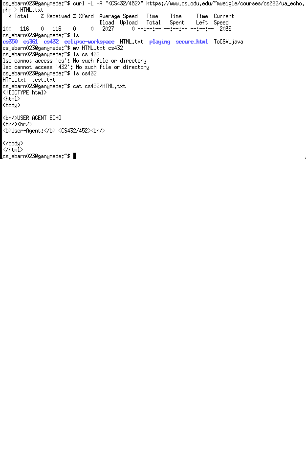

# HW# - One
### Ethan Barnes
### CS 432, Fall 2024
### 09/15/2024

# Q1
Consider the "bow-tie" structure of the web in the Broder et al. paper ["Graph Structure in the Web"](http://snap.stanford.edu/class/cs224w-readings/broder00bowtie.pdf) that was described in Module 1. 

Now consider the following links:

```text
A --> B
B --> A
B --> C
C --> D
C --> G
D --> A
D --> H
E --> F
E --> O
F --> G
G --> C
H --> L
J --> N
K --> I
M --> A
N --> L
O --> J
```

Draw the resulting [directed graph](https://en.wikipedia.org/wiki/Directed_graph) (either sketch on paper or use another tool) showing how the nodes are connected to each other and include an image in your report.  This does not need to fit into the bow-tie type diagram, but should look more similar to the graph on slide 24 from [Module-01 Web-Science-Architecture](https://docs.google.com/presentation/d/178GkNtFAPB5fzs1D-wdCnlOdbcTyhpAIz_wKxVUaHVk/edit#slide=id.ga9773ac230_0_799).

For the graph, list the nodes (in alphabetical order) that are each of the following categories:
* SCC: 
* IN: 
* OUT: 
* Tendrils: 
    * indicate if the tendril is reachable from IN or can reach OUT
* Tubes: 
    * explain how the nodes serve as tubes
* Disconnected:
    
    
## Answer


* SCC: A, B, C, D, G
* IN: M, F, O
* OUT: H, L, N
* Tendrils: E reaches IN
* Tubes: J, only accessible by IN and reaches only OUT
* Disconnected: K, I


# Q2

## Answer
a)


b)


c & d)




# Q3

## Answer

from bs4 import BeautifulSoup
import requests
import sys
import re

response = requests.get(sys.argv[1], timeout=5)

soup = BeautifulSoup((response.text), features="html.parser")

for links in soup.find_all('a'):
  print(links.get('href'))
  ##p = re.compile(r'^(\d+) bytes$')
  ##el = soup.find(text=p)
  ##size = p.match(el).group(1)
  ##print("here")
  ## print(size)

# References

* Google Colab, 432_Python.ipynb. [<https://colab.research.google.com/drive/1MGv7B89AhQr6SkQsjUEWV24ibLMq0dqf#scrollTo=8_wG_TQLDYA5>]
* zenrows, cURL User Agent: How to Set or Change It in 2024, [<https://www.zenrows.com/blog/curl-user-agent#what-is-curl-user-agent>]
